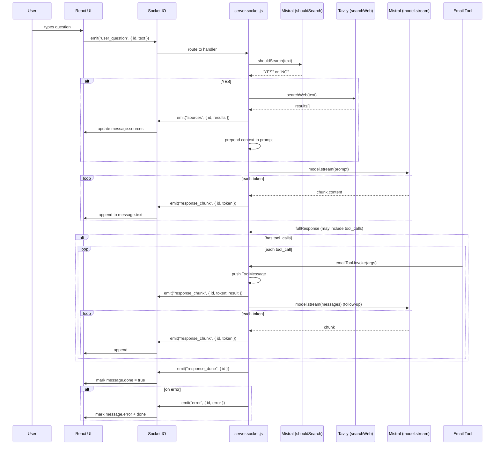

# Meridian AI

<p align="center">
  
  
  
  
  
  
  
  
  <br />
 =18" src="https://img.shields.io/badge/Node.js-%3E%3D18-339933?logo=nodedotjs&logoColor=white&style=flat-square" />
  
</p>

Real-time AI chat assistant with conditional web search, streaming responses, and tool-calling capabilities. Built with a clean layered architecture that separates transport, state, and presentation — designed so the AI core (`backend/core/`) can be reused independently of the chat interface.

---

## Features

| Capability                  | Description                                                                                                            |
| --------------------------- | ---------------------------------------------------------------------------------------------------------------------- |
| **Streaming responses**     | Token-by-token delivery via Server-Sent Events over Socket.IO                                                          |
| **Conditional web search**  | A Mistral AI classifier decides YES/NO whether a question needs a live search — no fragile keyword greylists           |
| **Source citations**        | When search runs, results appear as horizontal chip links before the answer                                            |
| **AI tool calling**         | Mistral can invoke tools mid-conversation; post-tool follow-up is streamed seamlessly                                  |
| **Email tool**              | Bound `send_email` tool that dispatches emails via Nodemailer (Gmail app passwords)                                    |
| **Real-time communication** | Socket.IO for bidirectional, low-latency event exchange                                                                |
| **Responsive UI**           | 720px centered dark-theme interface with auto-growing textarea, scroll detection, and thinking indicator               |
| **Type-safe frontend**      | Full TypeScript across shared event payload types                                                                      |
| **Decoupled AI core**       | `backend/core/` has zero dependencies on Express or Socket.IO — usable as a standalone module                          |
| **Transport abstraction**   | `services/socket.ts` does not expose the raw Socket.IO instance; the transport can be swapped without touching UI code |

---

## Architecture

```
┌─────────────────────────────────────────────────────┐
│                    Frontend                          │
│                                                      │
│  App.tsx (glue)                                      │
│    │ useChat │ useScroll                               │
│    ├── ChatMessage (memoized, presentational)         │
│    ├── ChatInput   (auto-grow, Enter/Shift+Enter)    │
│    ├── SourceChips (horizontal scrollable links)     │
│    └── ThinkingDots (CSS animation, reduced-motion)  │
│                                                      │
│  hooks/                                              │
│    ├── useChat    (messages state + socket wiring)    │
│    └── useScroll  (generic scroll detection)         │
│                                                      │
│  services/                                           │
│    └── socket.ts  (transport wrapper, no raw io())   │
│                                                      │
│  types/                                              │
│    └── chat.ts    (Source, Message interfaces)        │
└───────────────┬─────────────────────────────────────┘
                │  Socket.IO (wss)
┌───────────────▼─────────────────────────────────────┐
│                    Backend                           │
│                                                      │
│  server.js        Express + HTTP + static serve       │
│                                                      │
│  sockets/                                            │
│    └── server.socket.js   initSocket()                │
│          ├── shouldSearch() → Mistral YES/NO          │
│          ├── searchWeb()   → Tavily API              │
│          ├── model.stream() → response_chunk         │
│          ├── tool_calls    → execute → follow-up     │
│          └── per-session messages[]                  │
│                                                      │
│  core/  (reusable, no socket/express deps)           │
│    ├── model.js   ChatMistralAI singleton + emailTool│
│    └── search.js  Tavily wrapper                     │
│                                                      │
│  mail.service.js  Nodemailer transport               │
└─────────────────────────────────────────────────────┘
```

### Layer Responsibilities

**`types/`** — Pure data interfaces. No runtime logic, no framework imports.

**`services/`** — Transport layer. Encapsulates Socket.IO connection management and event wiring. Returns unsubscribe functions from every `on*` handler. The raw `io()` instance is never exported — swapping to WebSockets or SSE requires changing only this file.

**`hooks/`** — State management and side effects. `useChat` owns the `messages[]` array and subscribes to socket events. `useScroll` is generic (no chat-specific knowledge) and reusable in any scrollable list.

**`components/`** — Purely presentational. Driven entirely by props. `ChatMessage` is wrapped in `React.memo` with a custom comparator. `ChatInput` exposes an `onSend` callback with zero knowledge of how the message is delivered.

**`App.tsx`** — Glue layer. Composes hooks into components, decides auto-scroll behavior.

**`backend/core/`** — Framework-agnostic AI primitives. `model.js` exports a singleton `ChatMistralAI` instance with bound tools; `search.js` exports a `searchWeb` function. Import these into any Node.js project without Express or Socket.IO.

---

## Project Structure

```
meridian-ai/
├── backend/
│   ├── core/
│   │   ├── model.js              MistralAI singleton with send_email tool
│   │   └── search.js             Tavily web search wrapper
│   ├── sockets/
│   │   └── server.socket.js      Socket.IO server, event handlers, streaming
│   ├── server.js                 Express app, HTTP server, static file serve
│   ├── mail.service.js           Nodemailer Gmail transport
│   ├── .env.example              Environment variable template
│   └── package.json
├── frontend/
│   ├── src/
│   │   ├── types/
│   │   │   └── chat.ts           Source and Message interfaces
│   │   ├── services/
│   │   │   └── socket.ts         Typed Socket.IO wrapper (no raw export)
│   │   ├── hooks/
│   │   │   ├── useChat.ts        Messages state + socket event wiring
│   │   │   └── useScroll.ts      Generic scroll-to-bottom detection
│   │   ├── components/
│   │   │   ├── ChatMessage.tsx    Memoized user/bot messages with error state
│   │   │   ├── ChatInput.tsx      Auto-growing textarea, Enter/Shift+Enter
│   │   │   ├── SourceChips.tsx    Horizontal scrollable source link chips
│   │   │   └── ThinkingDots.tsx   CSS animated loading indicator
│   │   ├── App.tsx               Glue: useChat + useScroll + layout
│   │   ├── App.css               Layout styles (720px, centered)
│   │   ├── index.css             CSS variables, dark theme, resets
│   │   └── main.tsx              React entry point
│   ├── index.html
│   ├── vite.config.ts            Proxy /socket.io → localhost:3000
│   └── package.json
├── package.json                  Root scripts: build, start
└── .gitignore
```

---

## Data Flow



---

## Technology Stack

### Backend

| Library                                                                            | Version                | Purpose                                                      |
| ---------------------------------------------------------------------------------- | ---------------------- | ------------------------------------------------------------ |
| [Express](https://expressjs.com/)                                                  | 5.x                    | HTTP server, static file serving, middleware                 |
| [Socket.IO](https://socket.io/)                                                    | 4.x                    | Bidirectional real-time event communication                  |
| [LangChain](https://js.langchain.com/) (`@langchain/core`, `@langchain/mistralai`) | 1.1                    | LLM abstraction, message types, tool binding, streaming      |
| [Mistral AI](https://mistral.ai/)                                                  | `mistral-large-latest` | Primary LLM for classification, generation, and tool calling |
| [Tavily](https://tavily.com/) (`@tavily/core`)                                     | 0.7                    | Web search API with structured results                       |
| [Nodemailer](https://nodemailer.com/)                                              | 9.x                    | Email dispatch via Gmail SMTP                                |
| [Zod](https://zod.dev/)                                                            | 4.x                    | Runtime schema validation for tool parameter definitions     |
| [dotenv](https://github.com/motdotla/dotenv)                                       | 17.x                   | Environment variable loading                                 |

### Frontend

| Library                                       | Version | Purpose                                         |
| --------------------------------------------- | ------- | ----------------------------------------------- |
| [React](https://react.dev/)                   | 19.x    | UI framework with hooks and concurrent features |
| [TypeScript](https://www.typescriptlang.org/) | 5.9     | End-to-end type safety                          |
| [Vite](https://vitejs.dev/)                   | 7.x     | Dev server with HMR and production builds       |
| [socket.io-client](https://socket.io/)        | 4.x     | Client-side WebSocket transport                 |

---

## Design Decisions

<details>
<summary><b>Why a layered architecture?</b></summary>

Each layer has a single responsibility and zero knowledge of adjacent layers. `types/` defines data; `services/` handles I/O; `hooks/` manages state; `components/` renders UI; `App.tsx` composes them. This means any layer can be replaced independently. For example, migrating from Socket.IO to Server-Sent Events requires changing only `services/socket.ts` — all hooks and components remain untouched.

</details>

<details>
<summary><b>Why abstract Socket.IO behind a custom wrapper?</b></summary>

The `chatSocket` object in `services/socket.ts` exports send, on\*, and cleanup functions but **never** exposes the raw `io()` instance. This guarantees that no component or hook can accidentally call low-level Socket.IO methods. The transport becomes a swappable implementation detail — same interface could wrap an EventSource, WebSocket, or even a polling fallback.

</details>

<details>
<summary><b>Why do hooks contain logic while components remain presentational?</b></summary>

`useChat` owns the `messages[]` array, wires socket event subscriptions, and handles cleanup. `ChatMessage` receives a `message` prop and renders it — it never calls `chatSocket.*` or manages state. This split makes components unit-testable (no mocking of sockets) and hooks reusable across different view layers (React Native, CLI, etc.).

</details>

<details>
<summary><b>Why is the AI core reusable?</b></summary>

`backend/core/model.js` and `backend/core/search.js` import nothing from Express, Socket.IO, or the HTTP layer. They export plain async functions and a configured model instance. Any Node.js project can copy `backend/core/` and call `model.invoke()`, `model.stream()`, or `searchWeb()` directly — no chat server required.

</details>

<details>
<summary><b>Why a Mistral-based search classifier instead of a keyword greylist?</b></summary>

Keyword-based approaches produce false positives ("weather" triggers search even for "I like this weather") and false negatives (novel topics are missed). The Mistral YES/NO classifier costs ~$0.0001 per call and adapts to any phrasing. It is slower (~200ms) but dramatically more accurate.

</details>

<details>
<summary><b>Why a singleton model instance?</b></summary>

`ChatMistralAI` is created once at module import time and shared across all socket connections. LangChain's Mistral integration is stateless (conversation history lives in the per-socket `messages[]` array), so there is no risk of cross-user contamination. A singleton avoids creating a new HTTP client and API connection per request.

</details>

<details>
<summary><b>Why per-session message arrays instead of a database?</b></summary>

For a chat interface without user accounts, per-socket in-memory arrays provide zero-latency access and automatic cleanup on disconnection. A database adds latency, connection management, and schema migrations with no benefit until conversation persistence (history across sessions) is required.

</details>

---

## Deployment

The project ships as a single Express server that serves the built frontend as static files. This makes it deployable on any platform that supports Node.js.

### Required Environment Variables

| Variable          | Description                      |
| ----------------- | -------------------------------- |
| `MISTRAL_API_KEY` | Mistral AI API key               |
| `TAVILY_API_KEY`  | Tavily web search API key        |
| `EMAIL_USER`      | Gmail address for the email tool |
| `EMAIL_PASS`      | Gmail app password               |
| `PORT`            | Server port (default: 3000)      |

### Railway

```bash
# 1. Set the build command
#    npm run build
#
# 2. Set the start command
#    npm start
#
# 3. Add all environment variables from the table above
# 4. Deploy
```

### Render

```bash
# 1. Create a new Web Service
# 2. Build command: npm run build
# 3. Start command: npm start
# 4. Add environment variables
# 5. Deploy
```

The build step installs backend dependencies, installs frontend dependencies, and runs `tsc -b && vite build` to produce the production bundle in `frontend/dist/`. The server serves this directory at `/*`.

---

## Local Development

### Prerequisites

- Node.js >= 18
- A Mistral AI API key
- A Tavily API key

### Setup

```bash
# 1. Clone the repository
git clone <repo-url>
cd meridian-ai

# 2. Configure environment variables
cp backend/.env.example backend/.env
# Edit backend/.env with your API keys

# 3. Install dependencies (both backend and frontend)
npm run build
```

### Run

```bash
# Terminal 1 — Backend (port 3000)
cd backend && npm run dev

# Terminal 2 — Frontend (port 5173)
cd frontend && npm run dev
```

Open `http://localhost:5173` in a browser. The Vite dev server proxies `/socket.io` requests to the backend.

### Scripts

| Command                  | Description                                               |
| ------------------------ | --------------------------------------------------------- |
| `npm run build`          | Install all deps + build frontend for production          |
| `npm start`              | Start production Express server (serves built frontend)   |
| `npm run dev` (backend)  | Start backend with `node --watch` (Node 18+ auto-restart) |
| `npm run dev` (frontend) | Start Vite dev server with HMR                            |

---

## Future Improvements

| Area                       | Description                                                                        |
| -------------------------- | ---------------------------------------------------------------------------------- |
| **Conversation history**   | Persist messages to SQLite or PostgreSQL for cross-session continuity              |
| **Authentication**         | Add user accounts (Supabase, Auth0, or session-based)                              |
| **Multiple LLM providers** | Abstract the model behind an interface to support OpenAI, Anthropic, Google Gemini |
| **RAG**                    | Index crawled content into a vector store for retrieval-augmented generation       |
| **Memory**                 | Add summarization or sliding-window context management for long conversations      |
| **File uploads**           | Accept images/PDFs and process them via multimodal models or OCR                   |
| **Markdown rendering**     | Integrate `react-markdown` to render rich formatting, code blocks, and links       |
| **Docker**                 | Containerize both backend and frontend with a single `Dockerfile`                  |
| **System prompts**         | Allow runtime configuration of the system prompt per session or user               |

---

## License

MIT
